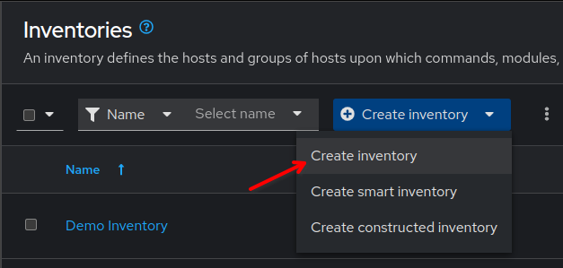
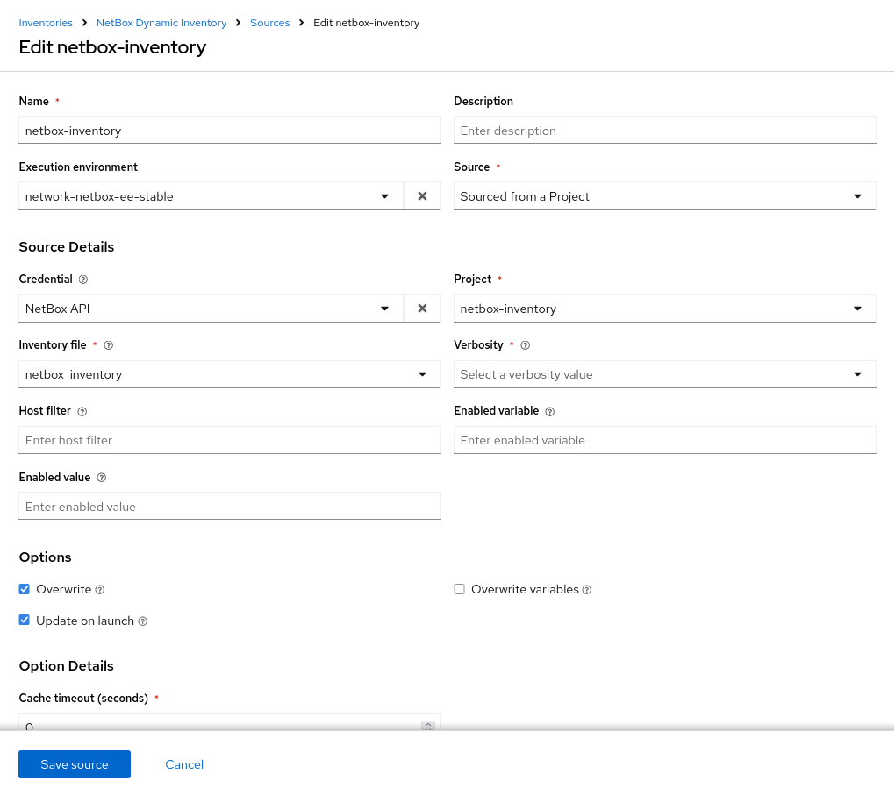

🗃️ Dynamic Inventories
===

A **inventory** in Ansible Auomation Platform is a collection of hosts against which jobs (i.e. playbooks) may be launched, the same as an Ansible inventory file when using the command line. It indicates which nodes will be managed by the control machine, in this case the Automation Execution controller.

If your Ansible inventory changes over time, with hosts spinning up and shutting down in response to business demands, the static inventory solutions described previously might not be the best option to manage your devices. You may need to track hosts from multiple sources: cloud providers, LDAP, and/or enterprise CMDB systems. With Dynamic Inventories you can do so automatically,

Ansible integrates all of these options through an external dynamic inventory system. Ansible supports two ways to connect with external inventories: Inventory plugins and inventory scripts. Inventory plugins take advantage of the most recent updates to the Ansible code and we recommend plugins over scripts for dynamic inventories, specially those from our partners in Certified Content Collection. And remember, you can write your own plugin to connect to additional dynamic inventory sources if needed.

We will explore how the inventory database on Red Hat Ansible Automation Platform syncs with NetBox as a dynamic inventory source, provides web and REST access to the results, and offers a graphical inventory editor. We will later use this integration with NetBox and Event-Driven Ansible to react and take action as we make changes to our Network Source of Truth.

### Integrating NetBox with Ansible

NetBox provides a Certified Ansible Collection, which includes modules and plugins for:
- Dynamic Inventory: Fetching real-time data from NetBox.
- State Definition: Ensuring network configurations match intended design.
- Querying Network Data: Extracting relevant details for playbooks.


☑️ Task 1 - Inventory project
===

1. We are going to be using a **Dynamic Inventory** plugin file, in this case from our parter **NetBox Labs** and their certified NetBox collection.
2. The NetBox collection provides the `netbox.netbox.nb_inventory` plugin to connect Ansible Automation Platform to NetBox.
3. To configure NetBox as the Dynamic Inventory we are going to use the following settings in our inventory file:

```
plugin: netbox.netbox.nb_inventory
config_context: true
validate_certs: False
group_by:
  - platforms
  - device_roles
  - sites

compose:
  ansible_network_os: platform.name
  ansible_host: custom_fields.host
  ansible_port: custom_fields.port
```

4. We are going to use a dedicated repository for our `netbox-inventory` file to make things easier to follow.
> [!NOTE]
> This file could be in a shared repository with Playbooks, but for clarity during the workshop we will be using separate repos
5. We already have this repo in our local **Gitea** and we are going to import it into AAP now.
6. Go to **Automation Execution > Projects > Create project**
7. Click **Create project**
8. Fill the form with the following:
```
  Name: netbox-inventory
	 Organization: Default
	 Execution environment: network-netbox-ee-stable
	 Source control type: Git
	 Source control URL: `https://gitea:3000/student/netbox_inventory.git`
```
9. Click the blue **Save project** at the bottom


☑️ Task 2 - NetBox credentials
===

We are going to create a **Custom Credential** now in Ansible Automation Platform to safely access NetBox through their API.

### Creating a Credential Type

1. Go to **Automation Execution > Infrastructure > Credential Types > Create credential type**
2. For the **Name** field, input `NetBox`
3. In **Description**: NetBox API token
4. In the **Input configuration** field, copy and paste the following:
```
fields:
  - id: NETBOX_API
    type: string
    label: NetBox Host URL
  - id: NETBOX_TOKEN
    type: string
    label: NetBox API Token
    secret: true
required:
  - NETBOX_API
  - NETBOX_TOKEN
```
5. In the **Injector configuration**, copy and paste the following:
```
env:
  NETBOX_API: '{{ NETBOX_API }}'
  NETBOX_TOKEN: '{{ NETBOX_TOKEN }}'
```

### Adding a custom Credential

1. Now that we have our **Custom Credential Type** ready, it's time to create our actual **Credential**.
2. Before we get to input the credential details, we need to get our NetBox API Token.
    1. Go to the [button label="NetBox"](tab-2) tab and ...
    2.  Click
    3. Click
    4. Copy the Token

Now let's use the Token:
1. Go to **Automation Execution > Infrastructure > Credentials > Create credential** and fill the form with the  following details:
2. **Name**: Enter `NetBox API`
3. **Organization**: Select `Default` from the dropdown
4. **Credential Type**: Select `NetBox` from the dropdown
5. **NetBox Host URL**: `http://netbox:8000`
6. **NetBox API Token**: `<<Paste the token here>>`


☑️ Task 3 - Creation of the Dynamic Inventory
===

Go to the [button label="AAP"](tab-0) tab.

1. On the left side-bar, click the **Automation Execution** menu option.
2. Now click the **Infrastructure** section to expand it and click on **Inventories**
3. Click on the blue **Create inventory** button
4. Select **Create inventory** from the dropdown.
   
5. Name it `NetBox Dynamic Inventory`.
6. In the **Organization** dropdown, select `Default`
7. Leave all the other fields as they are.
8. Click **Create inventory**

☑️ Task 4 - Add a Dynamic Source
===

> [!NOTE]
> If you are not in the  `NetBox Dynamic Inventory`, click on it again to edit it.

1. Inside the `NetBox Dynamic Inventory` you will see a tab bar.
2. On the tab bar, click on **Hosts**. You will notice it's empty.
3. Now on the same tab bar, click on **Sources**
4. Click the blue **Create Source** button
5. In the **Name** text box, enter `netbox-inventory`.
6. Click the **Execution Environment** field and select `network-netbox-ee-stable` from the dropdown.
7. Click the **Source** field and select `Sourced from a project` from the dropdown.
8. A new section titled **Source Details** will expand below
9. Click the **Credential Field** field and select `NetBox API` from the dropdown
10. Click the **Inventory file** field and select `netbox_inventory`
11. Click the **Verbosity** field and select `(1) Info`
12. In the **Options** section, tick the checkboxes for `Overwrite` and `Update on launch`. These two options will be useful to save time during our workshop. Check the tooltip to learn more about them!
13. To finish, click the blue **Save source** button




✅ Next Challenge
===
Press the **Next** button below to go to the next challenge once you’ve completed the task.

🐛 Encountered an issue?
====

If you have encountered an issue or have noticed something not quite right, please [open an issue](https://github.com/ansible/instruqt/issues/new?labels=netops-aap25&title=Issue+with+netops-aap25&assignees=leogallego)

<style type="text/css" rel="stylesheet">
  .lightbox {
    display: none;
    position: fixed;
    justify-content: center;
    align-items: center;
    z-index: 999;
    top: 0;
    left: 0;
    right: 0;
    bottom: 0;
    padding: 1rem;
    background: rgba(0, 0, 0, 0.8);
    margin-left: auto;
    margin-right: auto;
    margin-top: auto;
    margin-bottom: auto;
  }
  .lightbox:target {
    display: flex;
  }
  .lightbox img {
    /* max-height: 100% */
    max-width: 60%;
    max-height: 60%;
  }
  img {
    display: block;
    margin-left: auto;
    margin-right: auto;
  }
  h1 {
    font-size: 18px;
  }
    h2 {
    font-size: 16px;
    font-weight: 600
  }
    h3 {
    font-size: 14px;
    font-weight: 600
  }
  p span {
    font-size: 14px;
  }
  ul li span {
    font-size: 14px
  }
</style>
