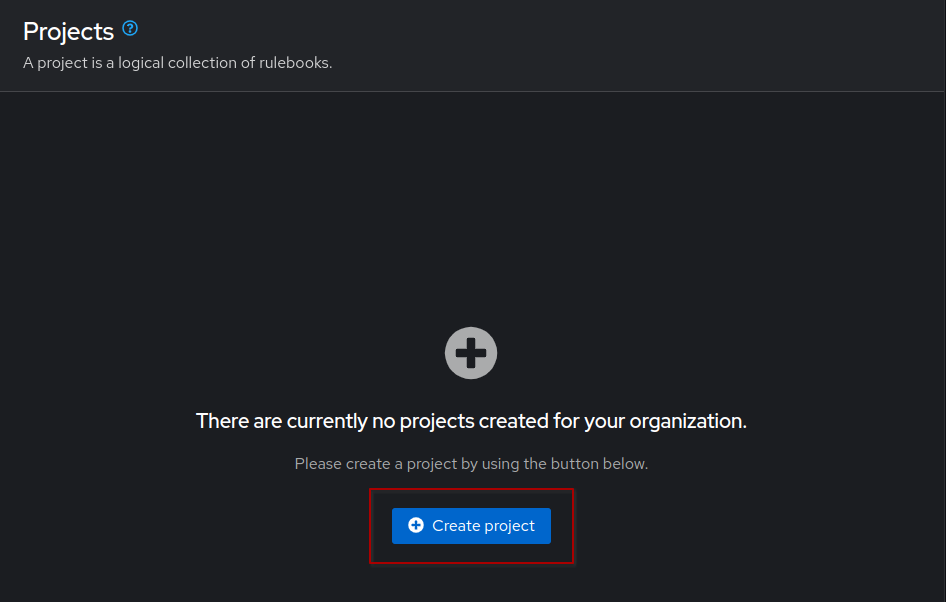

EDA: Setup Rulebook and remediation
===

In this challenge, we will create a Rulebook activation and a Job Template that performs remediation when a certain event occurs. In this case, when a port is shutdown it will triger and event to restore it.

☑️ Task 1 - Importing our Rulebook Project
===

1. Go to the [button label="AAP"](tab-0) tab. In the **Automation Decisions** section, choose **Projects** and click on **Create project** button.

> [!IMPORTANT]
> Make sure you are in the **Automation Decisions** menu!

  

2. Populate the form with the following details and click on **Create project**.

  ```
  Name: NetOps Rulebooks
  Organization: Default
  Source control type: Git
  Source control URL: http://gitea:3000/student/aap_workshop.git
  Verify SSL: disable
  ```

  

3. Wait for the project to be synchronized and then move on to the next step.

☑️ Task 2 - Setting up our Rulebook
===


> [!NOTE]
> Do not confuse Decision Environments (DE) with Execution Environments (EE). DEs are for Rulebooks, while EEs are for Playbooks. They are similar in the sense that they are containers and have all the collections with the required files and runtimes to execute their actions, but they serve different purposes.

1. Switch to the [button label="VS Code"](tab-5) tab
2. Create a new file for our rulebook named `kafka-interface-rules.yml` in the `rulebooks` directory

```yaml
- name: Look for interface shutdown events and remediate
  hosts: localhost
  sources:
    - ansible.eda.kafka:
        topic: network
        host: broker
        port: 9092

  rules:
    - name: Retrieve Data and Launch Job-template
      condition: events.body.fields.new_state == "interface-notif-state-down"
      action:
        run_job_template:
          name: "EDA-Fix-Ports"
          organization: "Default"
          job_args:
            extra_vars:
              interface: "{{ event.body.fields.if_name }}"
              rtr: "{{ event.body.fields.host_name }}"

```
> [!NOTE]
> The `EDA-Fix-Ports` Job Template hasn't been created yet, we will create it in the next step.

### What will this rulebook do?

- This rulebook will use the `ansible.eda.kafka` source plugin to listen for events from the `Kafka` topic called `network` that we created in the previous step.
- The Cisco router will forward the telemetry data to `Telegraf`, which will receive it using the `cisco_telemetry_mdt` input plugin, decode it and write it to the `network` topic.
- This rulebook has a single rule named `Retrieve Data and Launch Job-template` which looks for an event signifying that an interface went down.
- Once this rule is matched, the job template `EDA-Fix-Ports` will be launched and EDA will pass the name of the affected interface as an extra variable to it.

> [!NOTE]
> Rulebook Activation starts a specific Ansible Rulebook to listen to an event source. This runs inside a `Decision Environment`. Decision Environments are containers with every thing you need to run ansible-rulebook such as event source, plugins, etc.

3. Now we need to commit our new file and changes to our git repository, before we can sync our project in AAP.
4. In VS Code you will notice a number appeared in the third icon of the left side bar (image reference 1 below) and our file has a sign next to it (image reference 2 below)

5. This means we have changes to commit to our repository. Click the third icon on the sidebar (1)
6. Add a descriptive message of what you are changing (1) and click the blue **Commit** button (2)
  
7. You will notice the same button changed and now says **Sync changes**, click on it.
  

### Importing our Rulebook to AAP

1. Let's switch to the [button label="AAP"](tab-0) tab now.
2. Before creating our **Rulebook Activation**, we need to resync our `NetOps Rulebooks` EDA Project to retrieve the latest files/changes.
3. Go to **Automation Decisions** left sidebar menu, click on **Projects**
4. Click on the **Sync project** arrows at the end of our `NetOps Rulebooks` project
  
5. Now we can move to create our Rulebook Activation
6. In the **Automation Decisions** left sidebar menu, click on **Rulebook Activations**.

  

7. Click on **Create rulebook activation**, fill out the form with the following details and click on **Create rulebook activation**.

  ```
  Name: Cisco Telemetry
  Organization: Default
  Project: NetOps Rulebooks
  Rulebook: kafka-interface-rules.yml
  Credential: AAP
  Decision environment: NetOps Decision Environment
  Restart Policy: Always
  Log level: Info
  ```

  

8. Once saved, you will see that the Rulebook is running:

  


> [!NOTE]
> Ansible Rulebooks operates differently to Ansible Playbooks. A rulebook listens to the event source and runs each event through conditional rules. When rules are matched then the rulebook will trigger the action. This means Ansible Rulebooks will continue to run and process events as they arrive.

☑️ Task 3 - Setting up our remediation
===

The remediation is the action Ansible Automation Platform will take, by executing a Job Template with a Playbook to respond to an event that was triggered.

1. Switch to the [button label="VS Code"](tab-5) tab
2. You will be in the Git section, switch to the file Explorer of VS Code (first icon on the left sidebar)
3. Create a new file called  `cisco_no_shut.yml` in the `playbooks` directory
4.  The `cisco_no_shut.yml` playbook contains three tasks and runs against the Cat8000v device in our lab. In the first task, we "enable" an interface on the device (i.e., issue a `no shutdown` command). The interface name is a variable, that will be passed on to the playbook by the rulebook when a matching event occurs. In the second task we get the interface information, store it in a variable, which we then print in the third task.
5.  Copy and  paste the content below to the playbook:

```yaml
---
- name: Triage Down Interfaces
  hosts: cisco
  gather_facts: false
  tasks:
    - name: "Attempt a No shut for {{ inventory_hostname }} {{ interface }}"
      cisco.ios.ios_interfaces:
        config:
          - name: "{{ interface }}"
            enabled: True

    - name: "Check Interface State for {{ inventory_hostname }} {{ interface }}"
      cisco.ios.command:
        commands: show ip interface brief
      register: int_state

    - name: "Print Event Info"
      ansible.builtin.debug:
        var: int_state.stdout_lines[0]
```
5. Commit your changes to git in VS Code like you did in the previous task.

### Importing our Playbook into AAP

1. Let's switch to the [button label="AAP"](tab-0) tab now.
2. In the **Automation Execution** section in the left sidebar, click on **Projects** and for the `NetOps Playbooks` click the arrows at the end to **Sync project**
3. In the **Automation Execution** section, now click **Templates** > **Create template** > **Create job template**,
4. Populate the form with the following details and click on **Create job template**.

```
Name: EDA-Fix-Ports
Description: Bring up interface
Job type: Run
Inventory: NetOps Inventory
Project: NetOps Playbooks
Playbook: playbooks/cisco_no_shut.yml
Credentials: cat8000v-credential
Extra variables: Select Prompt on launch
```


> [!IMPORTANT]
> Make sure the `Prompt on launch` box in `Extra variables` is checked. This is to allow Event-Driven Ansible to be able to pass event payload data such as device names/ports etc to the Automation Controller as variables. This allows us to work with payload data in our automation.

That's it! Now we are all set to generate events from the Cisco router to trigger this Job Template run via EDA. Head on to the next exercise for more EDA controller fun!

✅ Next Challenge
===

Press the `Next` button below to go to the next challenge once you’ve completed the task.
