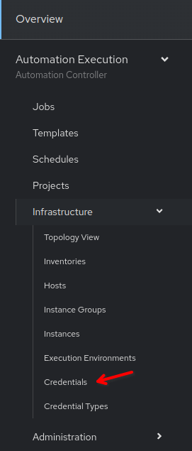
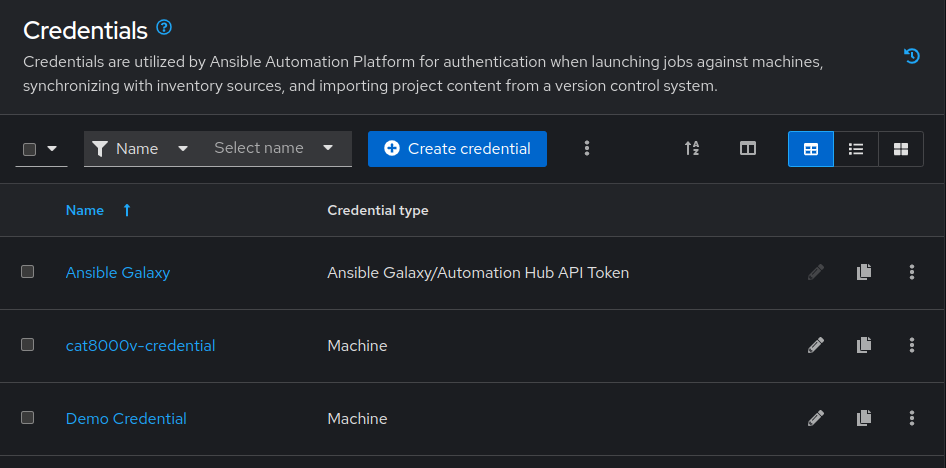
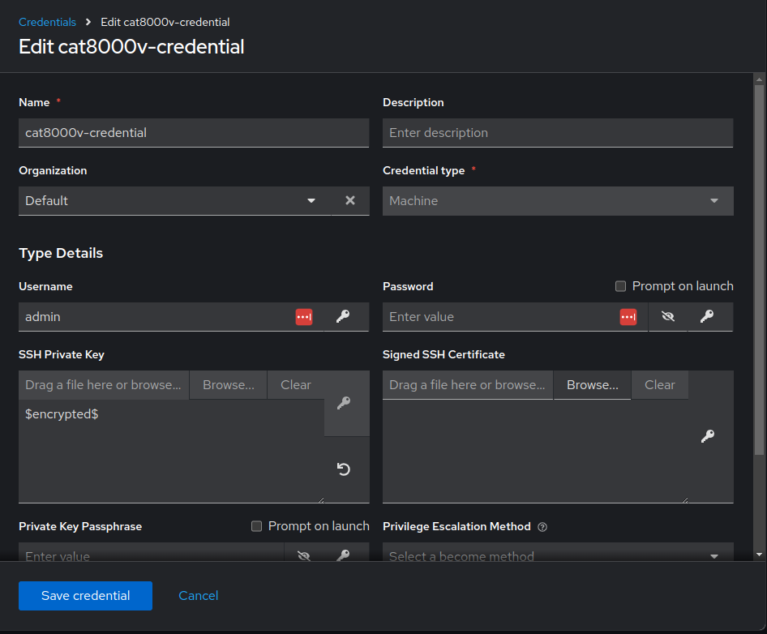

🔐 4. Credentials
===

**Credentials** are utilized by Ansible Automation Platform for authentication when launching jobs against devices or managed nodes, synchronizing with inventory sources, and importing project content from a version control system.

Credentials are imported and stored encrypted within Ansible Automation Platform, and are not retrievable in plain text on the command line by any user. You can grant users and teams the ability to use these credentials, without actually exposing the credential to the user itself.

There are multiple types of credential types, ranging from tokens, to user/passwords or public keys. In total, there are over 20 supported types and in case something is not covered, we  have the option to create a *Custom credential type*. We will explore the **Machine** credential type today, which we will use to connect to the servers in our inventory through SSH.

> [!IMPORTANT]
> In this exercise we are not making any changes. Credentials are pre-loaded. Please do not modify the input in the fields.

☑️ Task 1 - Exploring the Credentials section
===

1. In the sidebar, expand the **Automation Execution** section.
2. Now expand the **Infrastructure** menu and click the **Credentials** option.

  

3. This will display a searchable list of pre-loaded credentials, classified by name and type.
4. Look for the `cat8000v-credential`, notice it says **Machine** type. Click on it.

  
5. Here you can see the details of the credential. Notice the **SSH Private Key** field says **Encrypted**.
6. We are going to be using the same credential for all 3 devices in the `cisco` group, but you could have one credential per each host
7. Inside this view, click the tab **Job Templates** to see what Ansible playbooks are currently using this credential. It should be empty right now.

☑️ Task 2 - Exploring the Machine Type credential
===

1. Go back to the **Details** tab of the **cat8000v-credentials**
2. Click the **Edit credential** button
3. Look at the different fields available, but **don't edit or change anything**.
4. Notice how the **SSH Private Key** field only allows us to **Reset**. As we mentioned before, the key is encrypted and not retrievable.
5. To exit, click the **Cancel** button to avoid accidental modifications.

 

✅ Next Challenge
===
Press the `Next` button below to go to the next challenge once you’ve completed the task.

🐛 Encountered an issue?
====

If you have encountered an issue or have noticed something not quite right, please [open an issue](https://github.com/ansible/instruqt/issues/new?labels=netops-aap25&title=Issue+with+netops-aap25&assignees=leogallego)

