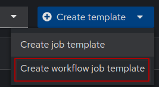
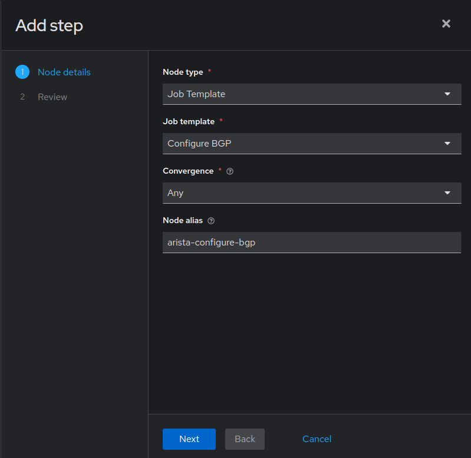
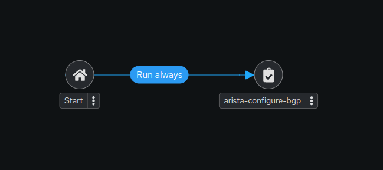
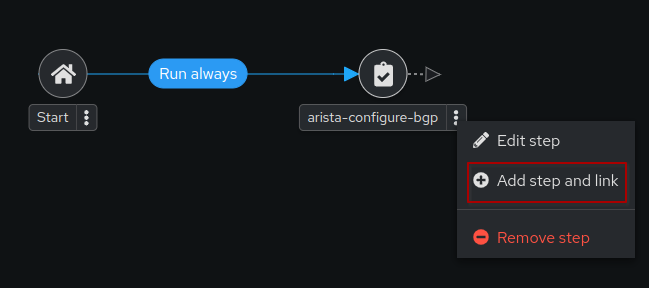
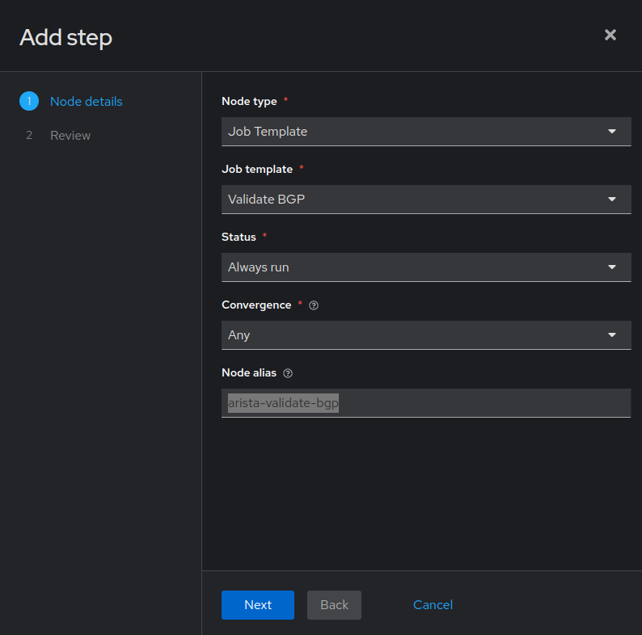
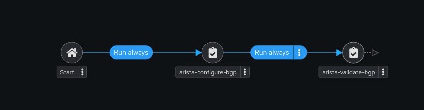
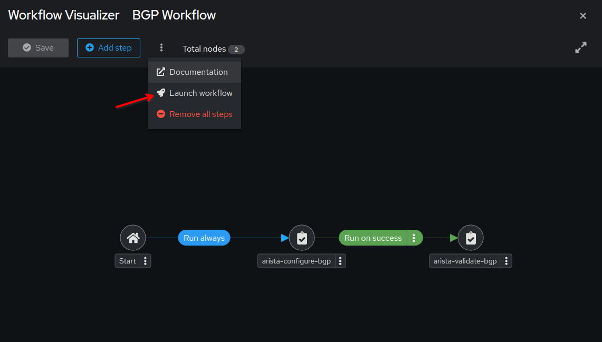
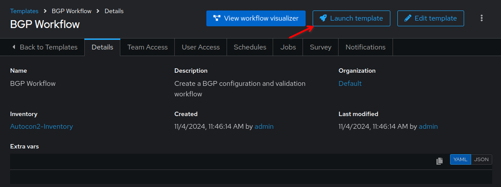
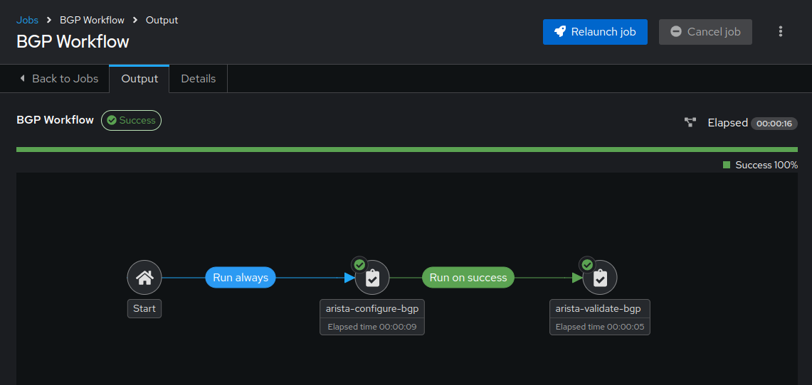

🔗 Workflows
===

A **Workflow Job Template** is a series of connected automation tasks (or Playbooks) that are executed in a specific order to achieve a desired outcome. Compared to an individual Playbook (or Job Template), a **Job Template** handles tasks in a single playbook, while a **Workflow job template** is designed to manage more complex automation scenarios involving multiple playbooks (or Job Templates) and decision-making processes (success or failure conditions for each Job Template).

- Job templates
- Workflow job templates
- Project syncs
- Inventory source syncs

Only **Workflow Job Templates** have the Workflow Visualizer icon (wf-viz-icon) as a shortcut for accessing the workflow editor.

> [!WARNING]
> Remember, do not confuse a **Job Template** with a **Jinja template**, or with a **Workflow Job Template**.  They are 3 separate things!

☑️ Task 1 - Creating a Workflow Template
===

1. Switch to the [button label="AAP"](tab-0) tab, login if required.
2. Click the **Automation Execution** dropdown in the sidebar
3. Click the **Templates** link
4. Click the **Create template** dropdown button and select **Create workflow job template**

  

5. In the **Name** field, input `Network Device Initial Setup Workflow`.
6. In the **Description** field, input: `Configure SNMP, NTP and VLANs in all Cisco devices`.
7. In the **Organization** dropdown, select `Default`.
8. In the **Inventory** field, select `NetOps Inventory` from the dropdown.
9. Leave everything else the same and click **Create workflow job template**.

  

☑️ Task 2 - Workflow Visualizer
===

1. This will take you to the Workflow Visualizer screen,
2. Click **Add step**, as the new Workflow is empty.
3. You will be presented with the **Add step** sidebar
4. For the **Node Type** field, select `Job Template` (default)
5. For the **Job Template** field, select `Network Device Initial Setup Workflow`  from the dropdown.
6. Leave **Convergence** in `Any`
7. For the **Node alias** field, enter `cisco-configure-snmp`, this is a simple label to use instead of the playbook name.

  ```bash
  Node Type: Job Template
  Job Template: Configure SNMP
  Convergence: Any
  Node alias: cisco-configure-snmp
  ```

  

8. Click the **Next** button. In the next screen, review everything is correct and click **Finish**.

  

☑️ Task 3 - Workflow Visualizer - Adding a condional step
===

1. Click the 3 dots next to the `cisco-configure-snmp`  box we created in the previous step.

2. Click the **Add step and link**
  
3. The same sidebar from before will show up to the right, this time with **one extra field**.
4. For the **Node Type** field, select `Job Template` (default).
5. For the **Job Template** field, select `Configure NTP`.
6. For the **Status** field, select `Run always` from the dropdown.
7. Leave **Convergence** in `Any`.
8. For the **Node alias** field, enter `cisco-configure-ntp`, this is a simple label to use instead of the playbook name.

  ```bash
  Node Type: Job Template
  Job Template: Configure NTP
  Status: Run always
  Convergence: Any
  Node alias: cisco-configure-ntp
  ```

  .

9. Click the **Next** button. Review everything and click **Finish**.

   


Congratulations!  You have created a **Workflow Job Template** consisting of two linked **Job Templates**.

> [!NOTE]
> You can zoom in and out with the mouse wheel.

☑️ Task 3 - Workflow Visualizer - Save!
===

Now for the final step, we are going to save our Workflow:

1. Click the blue **Save** button at the top. If you miss this one, you will lose your changes!

☑️ Task 4 - Launch the new Workflow
===

There are 2 ways to launch our newly created Workflow. First the easiest while working on the Workflow:

1. Within the same **Workflow Visualizer** screen
2. Click the 3 dots right below the name, at the top, and select **Launch workflow** from the dropdown.

  

3. Verify all the jobs executed successfully. You will  notice a **Success** text next to the Workflow name, as well as a ✅ tick in each job box.

Another option is to go back to the **Templates** list and

1. You can launch the Workflow from this list by clicking the 🚀 **Rocket** icon.

  

2. You can click on the `BGP Workflow`  name and click the **Launch template** button.

  

3. You will be presented with a smaller Workflow Visualizer that shows the progress of the execution as **Running**.

4. Verify all the jobs executed successfully. You will notice a **Success** text next to the Workflow name, as well as a ✅ tick in each job box.

  

✅ Next Challenge
===
You have successfully completed the `Introduction to Automation Controller` challenges!

Press the `Next` button below to go to the next section once you’ve completed the task to begin exploring Event-Driven Ansible.

🐛 Encountered an issue?
====

If you have encountered an issue or have noticed something not quite right, please [open an issue](https://github.com/ansible/instruqt/issues/new?labels=netops-aap25&title=Issue+with+netops-aap25&assignees=leogallego)

<style type="text/css" rel="stylesheet">
  .lightbox {
    display: none;
    position: fixed;
    justify-content: center;
    align-items: center;
    z-index: 999;
    top: 0;
    left: 0;
    right: 0;
    bottom: 0;
    padding: 1rem;
    background: rgba(0, 0, 0, 0.8);
    margin-left: auto;
    margin-right: auto;
    margin-top: auto;
    margin-bottom: auto;
  }
  .lightbox:target {
    display: flex;
  }
  .lightbox img {
    /* max-height: 100% */
    max-width: 60%;
    max-height: 60%;
  }
  img {
    display: block;
    margin-left: auto;
    margin-right: auto;
  }
  h1 {
    font-size: 18px;
  }
    h2 {
    font-size: 16px;
    font-weight: 600
  }
    h3 {
    font-size: 14px;
    font-weight: 600
  }
  p span {
    font-size: 14px;
  }
  ul li span {
    font-size: 14px
  }
</style>
