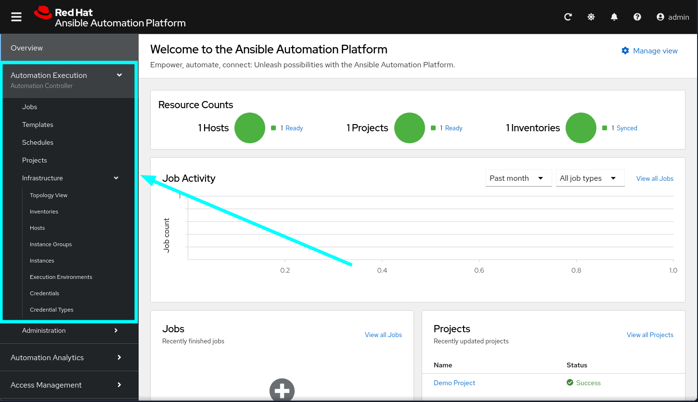
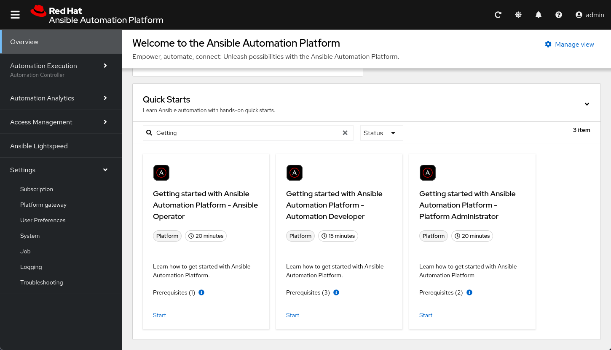
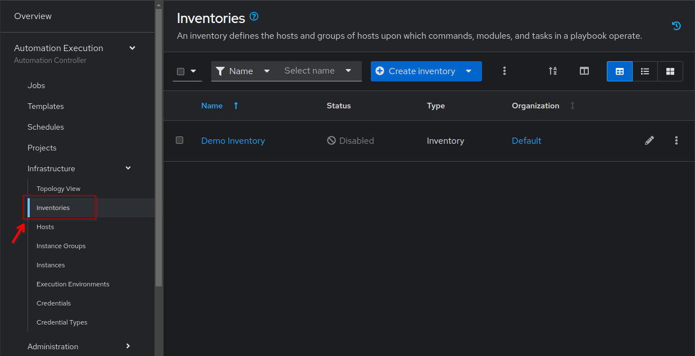
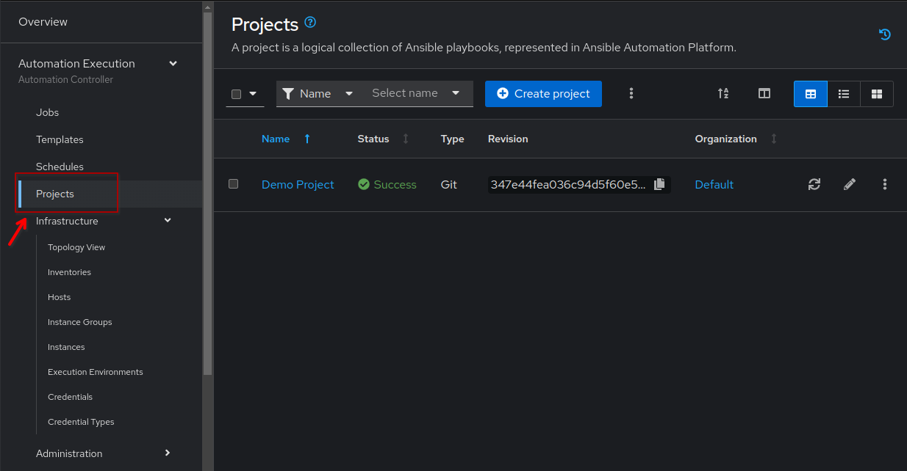
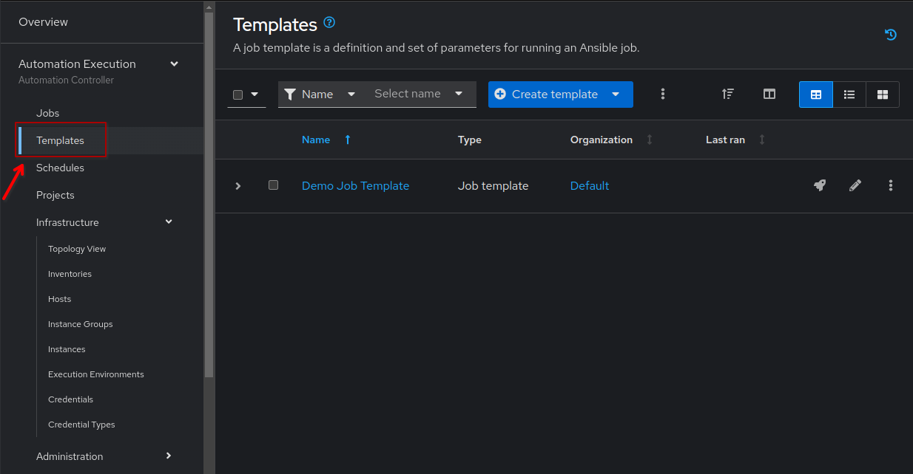

Welcome to Event-Driven Ansible for Network Automation
===

In this laboratory we will get started with Network Automation using **Ansible Automation Platform 2.5**.  We will do hands-on exercises to deploy and run the playbooks through the Ansible Automation Platform unified web-UI, as well as use **Event-Driven Ansible** to listen to various events occurring in your network in real time and take actions (execute playbooks) based on the events as required.

**NetOps** is an approach to network operations that focuses on rapid deployments and agility. It is also referred to as NetOps 2.0 or NetDevOps, and has become the standard operating procedure for digital enterprises working to keep pace with customer expectations. NetOps includes elements of automation, orchestration, and continuous validation to enable agile development and application delivery in modern IT organizations with complex network infrastructure.

👋 Introduction to Ansible Automation Platform web-UI
===

Welcome to Ansible Automation Platform.

Red Hat Ansible Automation Platform includes a web-UI and API that allows you to define, operate, scale, and delegate automation across the enterprise.

The new unified UI in Ansible Automation Platform 2.5 has integrated all the components into a single control dashboard. We will be exploring the Automation Execution (automation controller) and Automation Decision (event-driven ansible) functionality during this laboratory.

For this exercise we will focus on the **Automation Execution (Automation controller)** and it's features, highlighted below:

In the following challenges we will  show you how to run your Ansible automation through the web-UI like you would in a corporate environment for operating the automation.

Switch to the  [button label="AAP"](tab-0) tab and you should see the Ansible Automation Platform login screen.

Login to it using the following credentials and then continue on to the tasks:

> [!IMPORTANT]
> * Username: `admin`
> * Password: `ansible123!`

☑️ Task 1 - Explore the Overview
===

Explore the **Overview**.  The initial screen will show little information due to the lack of playbooks, hosts, and executions, but take a look now and you will be able to compare it to the end result once you finished the lab.

You will find the following card-like sections in the **Overview** screen:

* **Resource counts**: This section will show a summary of **hosts**, **projects** and **inventories**
* **Job activity**: This section will show a graph of the Job runs during the past month
* **Jobs**: A list of recently run jobs
* **Projects**: A list of recently updated projects
* **Inventories**: A list of recently updated inventories

If you click any of the titles (or "View all" links) it will take you to the corresponding section. We recommend you take a peek at them.

And at the bottom, check the new card-like section in the Overview screen of Ansible Automation Platform 2.5 that includes the new **Quick Start Guides**, our interactive in-line tutorials:

This new section will prove to be very useful for learning about all the features in AAP right after you install it, as you will get instructions for using them without leaving the interface.

☑️ Task 2 - Explore the Inventories section
===

In the left side-bar, click on the **Automation Execution** drop-down menu to expand it. Go to **Infrastructure** > **Inventories** and explore the pre-loaded **Demo inventory**  . For now, just explore the different tabs to familiarize with the fields. You will create your own soon!

An **Inventory** is a collection of hosts against which playbooks may be launched or run against. Basically, the "managed nodes" or devices we are automating. The inventory here is the same as an inventory file you might know from working with Ansible on the command line.

**Inventories** in AAP have several advantages over file based ones, you get all the functionality from the latter ones, with added features and better reusability.

☑️ Task 3 - Explore the Projects section
===

In the sidebar menu, under the **Automation Execution** click on the **Projects** submenu and explore the pre-loaded **Demo project**. You will see all the fields available to use when creating one. Don't forget to look at the tabs!

**Projects** are logical groups of Ansible playbooks in automation controller. These playbooks usually reside in a source code version control system like Git (and platforms as Github or Gitlab). With **Projects** we can reference a repository or directory with one or several playbooks, that we will later use.

☑️ Task 4 - Explore the Templates section
===

In the sidebar menu, under the **Automation Execution** click on the **Templates** submenu and explore the pre-loaded **Demo Job Template**.

A **Job Template** is a definition and set of parameters for running an Ansible job. Job templates are useful
to run the same job many times. They also encourage the reuse of Ansible Playbook content and
collaboration between teams. Later on in this workshop, we will be creating our own Job Templates.

✅ Next Challenge
===

Press the `Next` button below to go to the next challenge once you’ve completed the tasks.

🐛 Encountered an issue?
====

If you have encountered an issue or have noticed something not quite right, please [open an issue](https://github.com/ansible/instruqt/issues/new?labels=netops-aap25&title=Issue+with+netops-aap25&assignees=leogallego).

