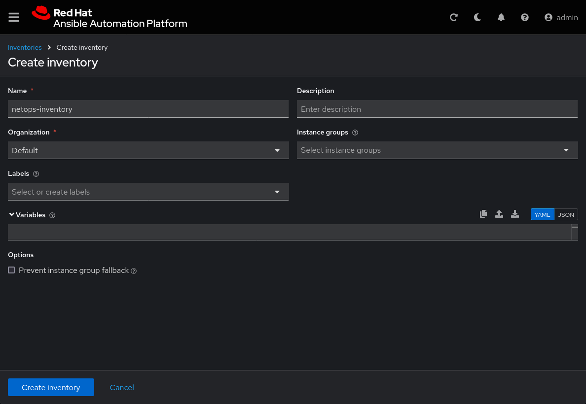
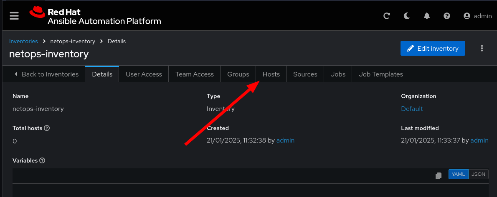
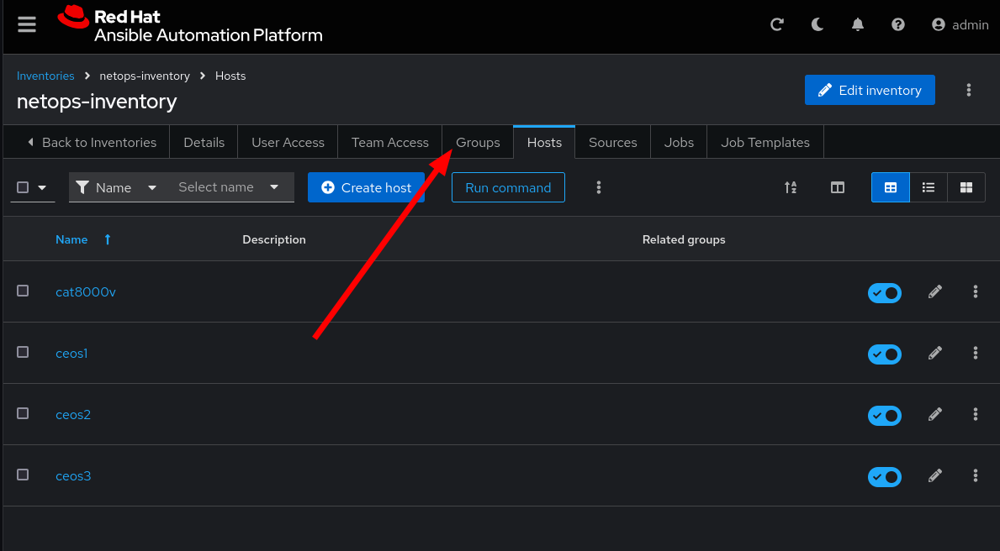

🗃️ Inventories
===

An **inventory** in Ansible Auomation Platform is a collection of hosts against which jobs (i.e. playbooks) may be launched, the same as an Ansible inventory file when using the command line. It indicates which nodes will be managed by the control machine, in this case the Automation Execution controller.

**Inventories** may be divided into *groups* and these groups contain the actual *hosts*. The *hosts* may be sourced manually or dynamically and can be referenced by their **IP addresses** or their **hostnames**.

With **Automation Execution (Automation controller)** you will be able to run multiple playbooks against these inventories without recreating them.

☑️ Task 1 - Creation of the Inventory
===

Go to the [button label="AAP"](tab-0) tab.

1. On the left side-bar, click the **Automation Execution** menu option.
2. Now click the **Infrastructure** section to expand it and click on **Inventories**
3. Click on the blue **Create inventory** button
4. Select **Create inventory** from the dropdown.
   
5. Name it `NetOps Inventory`.
6. In the **Organization** dropdown, select `Default`
7. Leave all the other fields as they are.
   
8. Click **Create inventory**

☑️ Task 2 - Add hosts to the NetOps Inventory
===

> [!NOTE]
> If you are not in the  `NetOps Inventory`, click on it again to edit it.

1. Inside the `NetOps Inventory` you will see a tab bar.
2. On the tab bar, click on **Hosts**.
   
3. Click on the blue **Create host** button in the center.
4. We are going to add three **Cisco Catalyst 8000V** devices
5. In the **Name** text box, enter `cat1`.
6. Under **Variables**, enter `ansible_host: cisco`
7. Click **Create host**
8. Use the breadcrumb **"< Back to Hosts"** on the tab bar, or click **Hosts** on the sidebar.
9. Repeat the above steps to create a new host, named `cat2` with a variable `ansible_host: cisco2`
10. Repeat the above steps to create a new host, named `cat3` with a variable `ansible_host: cisco3`

☑️ Task 4 - Create the [cisco] groups in NetOps Inventory
===

1. On the sidebar, go to **Inventories** and click on  the `NetOps Inventory`
2. On the tab bar of `NetOps Inventory`, click on the **Groups** tab
   
3. Click on the **Create group** button to create a new group.
4. Name the group `cisco` (NOTE: you don't need to input it with the brackets `[...]` like you would in an inventory file).
5. Populate the **Variables** field with the following variables. These will be applied to all the Cisco hosts in this group.
  ```yaml
  ansible_connection: ansible.netcommon.network_cli
  ansible_network_os: cisco.ios.ios
  ansible_user: admin
  ```
6. Click **Create group**.


☑️ Task 6 - Add the Catalyst devices to the [cisco] group in NetOps Inventory
===

1. Use the breadcrumb **"< Back to Groups"** on the tab bar.
2. Click on the `cisco`  group you created, and then click on the **Hosts** tab on the top menu.
3. Click **Add existing host**. A pop up will appear.
4. Tick all 3 devices, `cat1`, `cat2` and `cat3`, then click **Add hosts**.
5. Verify the *Cisco Catalyst* devices  are now added to the `cisco` group in the **Hosts** tab.

✅ Next Challenge
===
Press the **Next** button below to go to the next challenge once you’ve completed the task.

🐛 Encountered an issue?
====

If you have encountered an issue or have noticed something not quite right, please [open an issue](https://github.com/ansible/instruqt/issues/new?labels=netops-aap25&title=Issue+with+netops-aap25&assignees=leogallego)

<style type="text/css" rel="stylesheet">
  .lightbox {
    display: none;
    position: fixed;
    justify-content: center;
    align-items: center;
    z-index: 999;
    top: 0;
    left: 0;
    right: 0;
    bottom: 0;
    padding: 1rem;
    background: rgba(0, 0, 0, 0.8);
    margin-left: auto;
    margin-right: auto;
    margin-top: auto;
    margin-bottom: auto;
  }
  .lightbox:target {
    display: flex;
  }
  .lightbox img {
    /* max-height: 100% */
    max-width: 60%;
    max-height: 60%;
  }
  img {
    display: block;
    margin-left: auto;
    margin-right: auto;
  }
  h1 {
    font-size: 18px;
  }
    h2 {
    font-size: 16px;
    font-weight: 600
  }
    h3 {
    font-size: 14px;
    font-weight: 600
  }
  p span {
    font-size: 14px;
  }
  ul li span {
    font-size: 14px
  }
</style>
