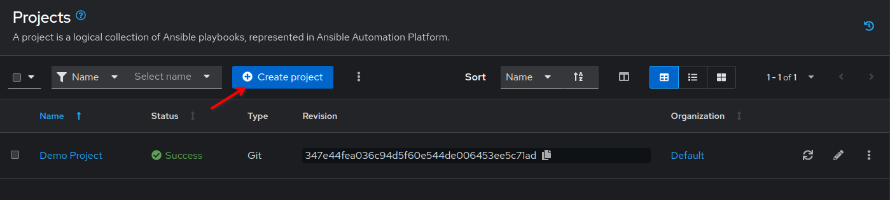

 💡 Projects
===

A **Project** in Automation Execution *(formerly Automation controller)* are one or more Ansible playbooks (and related roles, etc.) inside a directory. Usually, they are in a Source Control Management system like a **Git** repository. We use **Projects** to "*import*" our playbooks into Ansible Automation Platform.

In this challenge, you will create your first **Project** and import from the provided Git repository `aap_workshop`. This repository is provided by a local Gitea server we have installed as part of the lab and you can find it's web based user interface in the Gitea tab.

☑️ Task 1 - Creation of the Project
===

1. Expand the **Automation Execution** section in the sidebar menu.
2. Click the **Projects** link in the menu.
3. Click the **Create project** button.

  

Fill out the form with the following details:

1.   **Name**: `NetOps Playbooks`
2.   **Organization**: `Default`
3.   **Source Control Type**: `Git`.
4.   **Source Control URL**: `http://gitea:3000/student/aap_workshop.git`
5.   Leave all other fields as they are.
6.   and click on **Create project** at the bottom.

  > [!NOTE]
> The **Source Control URL** will be the URL to the repository `aap_workshop` in the Gitea server, this field will appear after `Git` has been selected as the **Source Control Type**.

☑️ Task 2 - Verify the new Project synced successfully
===

1. After creating you should be taken to the **Details** tab of the new Project.
2. Verify that the **Status** for our `NetOps Playbooks` project is green and reads **Success**.
3. Click the **Success** text and review the output of the sync

✅ Next Challenge
===
Press the **Next** button below to go to the next challenge once you’ve completed the challenge.

🐛 Encountered an issue?
====

If you have encountered an issue or have noticed something not quite right, please [open an issue](https://github.com/ansible/instruqt/issues/new?labels=netops-aap25&title=Issue+with+netops-aap25&assignees=leogallego)

