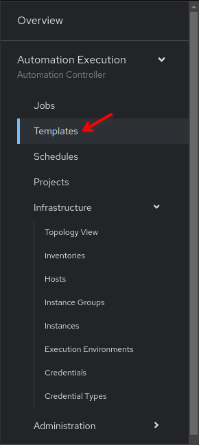
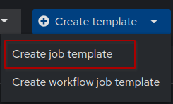
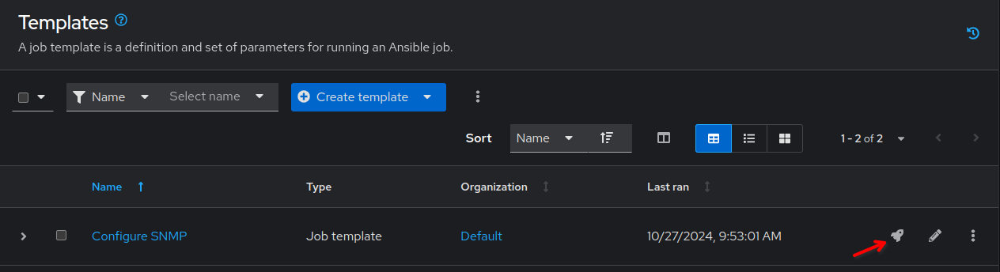
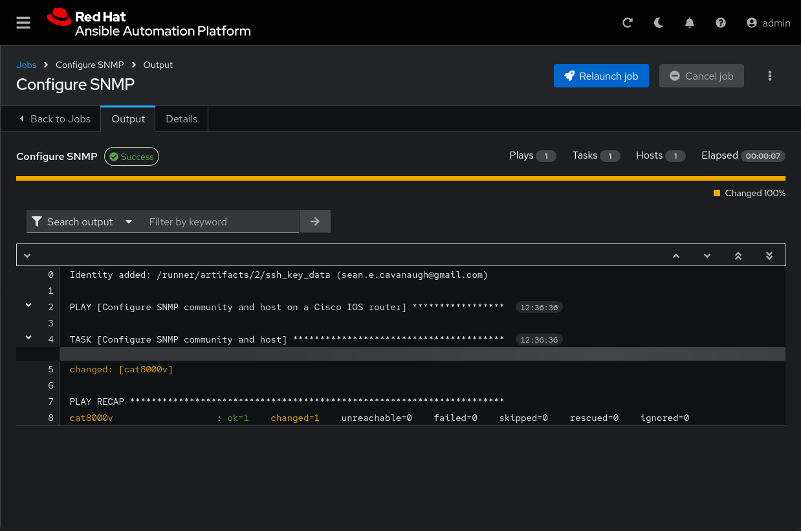
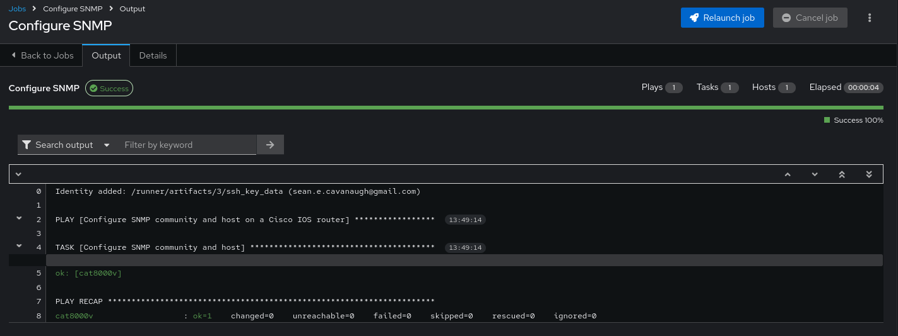

📑 Job Templates
===

In Ansible Automation Platform a **Job Template** is a definition and set of parameters for running an Ansible playbook. Job Templates are useful to execute the same job many times while also encouraging the reuse of Ansible content and collaboration between teams.

To create a **Job Template** you need to have a **Project** (a repository or directory) from which to source our *Playbooks*. We created our **Project** called `NetOps Playbooks` in the previous challenge. Also, note that although a **Project** might contain multiple *Playbooks*, a **Job Template** can only run one of those playbooks.

> [!WARNING]
> **Do not confuse a Job Template with a Jinja template**. Jinja templates are used to create dynamic template files, with variables and facts that will be replaced during runtime. This is very useful for configuration files for example. If you don't know Jinja, don't worry about it right now, just know that they are different things.

☑️ Task 1 - Creation of the Job Template for SNMP
===

1. Click the **Templates** link under the **Automation Execution** section of the sidebar.

  
2. Click the **Create template** dropdown button and select **Create job template**. Fill out the form with the following details.

  

3. **Name** the Job Template as `Configure SNMP`
4. For the **Job Type** field, leave the default: `Run`
5. For the **Inventory** field, click and and select `NetOps Inventory` from the dropdown
6. For the **Project** field, click and select `NetOps Playbooks` from the dropdown
7. For the **Playbook** field, click and you will notice that it's auto populated with all the playbooks available in the *Project* repository we selected.
8. Choose the `solutions/playbooks/snmp.yml`. We are using a provided playbook for this exercise, in the following exercises you will need to create the files.
9. For the **Credentials** field,  click and only tick `cat8000v-credential` from the dropdown. You can click outside the dropdown to close. No need to click browse right now, but if you do, simply click confirm.
9. Leave all the other fields the same and click **Create job template**.

> [!IMPORTANT]
> Note that the **Credentials** field is not mandatory when creating a **Job Template**, but if you don't select the right credentials for the hosts you are executing against, the tasks will fail as AAP won't be able to connect to those devices..

☑️ Task 2 - Launch the new Template
===

1. Click the **Templates** link in the **Automation Execution** section of the sidebar.
2. You can launch it from this list, by clicking the **Rocket** icon, or by clicking on the `Configure SNMP` template and then clicking the **Launch** button at the bottom.

  

4. Verify the execution was successful and the devices were "changed" (in yellow).
  
5. Congratulations! 🎉 You have successfully run your first Job Template in AAP!
6. If we run the same **Job Template** on the same devices as before, the output will be different because of idempotency
8. Try it! Launch the Job Template again by pressing the blue **Relaunch Job** button  at the top right.

✅ Next Challenge
===
Press the **Next** button below to go to the next challenge once you’ve completed the task.

🐛 Encountered an issue?
====

If you have encountered an issue or have noticed something not quite right, please [open an issue](https://github.com/ansible/instruqt/issues/new?labels=netops-aap25&title=Issue+with+netops-aap25&assignees=leogallego)

