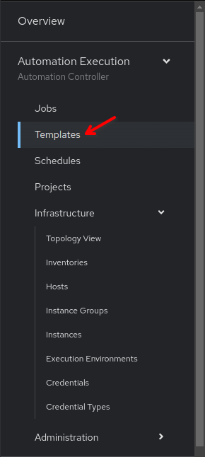

📑 Job Template with a Survey
===

In this challenge, we will explore the **Survey** feature, which allows us to input a variable at runtime when we execute our **Job Template** (playbook), making it possible to change a parameter or setting at each run. We will be changing the login banner of the 3 Cisco Cat8000v devices in our inventory.

☑️ Task 1 - Creating a second Job Template
===

1. Go to the [button label="AAP"](tab-0) tab and click the **Templates** link under the **Automation Execution** section of the sidebar.

  

2. Click the **Create template** dropdown button and select **Create job template**. Fill out the form with the following details.

  

3. Fill out the form with the following details and click on **Create job template**.

  ```bash
  Name: Update Banner
  Description: Create or update banner on Cat8000v using Surveys
  Job type: Run
  Inventory: NetOps Inventory
  Project: NetOps Playbooks
  Playbook: solutions/playbooks/banner.yml
  Credentials: cat8000v-credential
  ```


### But what did we import?

The `banner.yml` playbook configures a banner on Cisco devices. The `banner` and the `text` parameters are set to `banner_type` and `network_banner` variables respectively.
We are going to take these as *inputs* from a `survey` while launching the job template.
We will also set a default value, in case we don't have any inputs, to avoid the playbook to fail.

☑️ Task 2 - Adding Surveys to the Job Template
===

1. Once the Job Template is created, go to the **Survey** tab.


2. Click on **Create survey question**.
3. Fill the form with the following details
4. And click on the  blue **Create survey question** button at the bottom to save.

  ```
  Question: What is the banner type?
  Description: Enter a supported banner type
  Answer variable name: banner_type
  Answer type: Text
  Default answer:  login
  ```


4. Now, let's click on blue **Create survey question** button again
5. Fill the form with the following details this time.

  ```
  Question: What is the banner message?
  Description: Enter the banner message
  Answer variable name: network_banner
  Answer type: Text
  Default answer: This is the default banner message
  ```


7. Click on **Create survey question** once done.
8. Now to finish, let's enable the survey for this Job Template.

  

☑️ Task 3 - Executing the Job Template
===

1. Once survey is enabled for this Job Template, launch it by clicking on the **Launch Template** button.

  

2. This will start the survey. Enter the following answers for the `What is the banner type?` and `What is the banner message?` questions.

> [!NOTE]
> You will need to replace the default values we set.

  ```bash
  What is the banner type? - login
  What is the banner message? - Login banner at Cisco Live!
  ```

3.  Click on **Next**.
4. Review the **Extra vars** section and click on **Finish**.
5. The **Job Template** would start to run. Wait for it to complete.

☑️ Task 4 - Verifying the banner
===

1. Go to the [button label="Terminal"](tab-2) tab and ssh to the `cisco` device.

  ```bash
  ssh admin@cisco
  ```

2. As you login to the device, you should already see the new banner message.


✅ Next Challenge
===
Press the **Next** button below to go to the next challenge once you’ve completed the task.

🐛 Encountered an issue?
====

If you have encountered an issue or have noticed something not quite right, please [open an issue](https://github.com/ansible/instruqt/issues/new?labels=netops-aap25&title=Issue+with+netops-aap25&assignees=leogallego)

<style type="text/css" rel="stylesheet">
  .lightbox {
    display: none;
    position: fixed;
    justify-content: center;
    align-items: center;
    z-index: 999;
    top: 0;
    left: 0;
    right: 0;
    bottom: 0;
    padding: 1rem;
    background: rgba(0, 0, 0, 0.8);
    margin-left: auto;
    margin-right: auto;
    margin-top: auto;
    margin-bottom: auto;
  }
  .lightbox:target {
    display: flex;
  }
  .lightbox img {
    /* max-height: 100% */
    max-width: 60%;
    max-height: 60%;
  }
  img {
    display: block;
    margin-left: auto;
    margin-right: auto;
  }
  h1 {
    font-size: 18px;
  }
    h2 {
    font-size: 16px;
    font-weight: 600
  }
    h3 {
    font-size: 14px;
    font-weight: 600
  }
  p span {
    font-size: 14px;
  }
  ul li span {
    font-size: 14px
  }
</style>
