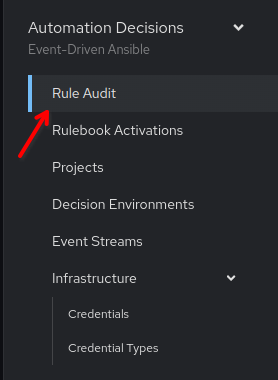
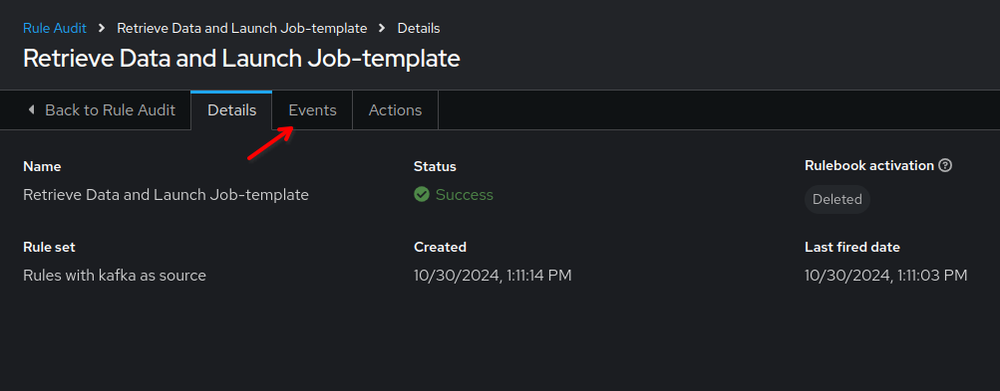
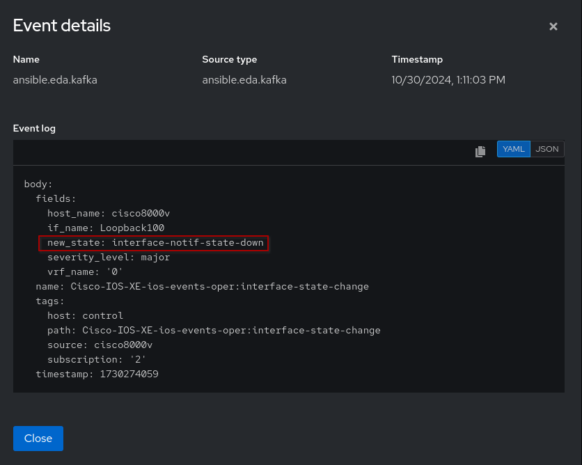
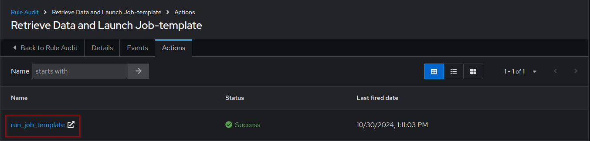
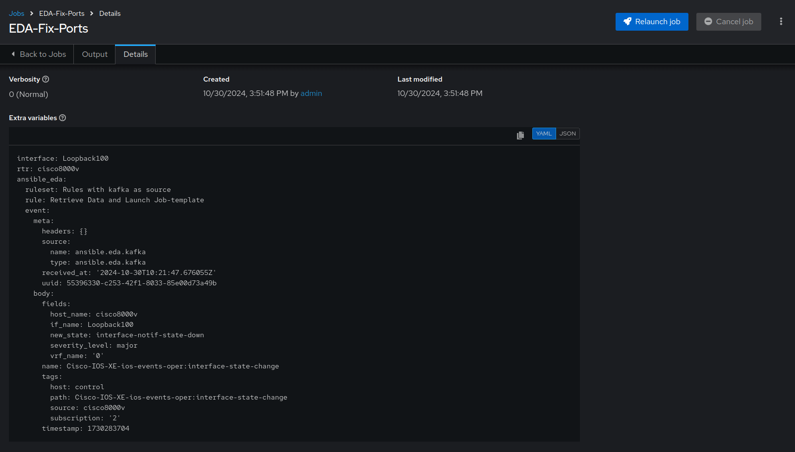
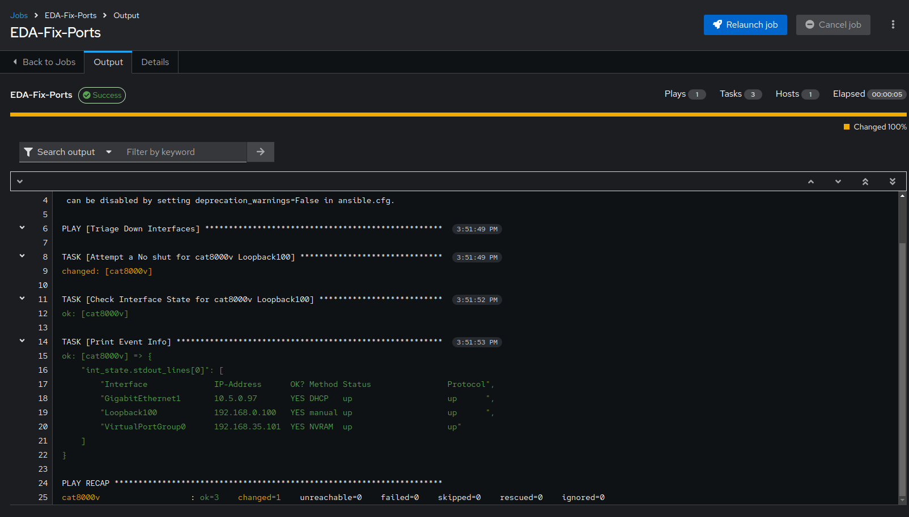

EDA: Automated remediations
===

In this challenge we will test the event handling from a simple interface event. This should allow EDA Controller to trigger remediation from automation controller.

☑️ Task 1 - Generating telemetry events to trigger automated actions
===

In the previous step, we started a `Rulebook Activation`, which should be running right now. Now, let us test it with an event.

1. Navigate to the [button label="Terminal"](tab-0) tab and login to the `cisco` router, if you haven't already.

  ```bash
  ssh admin@cisco
  ```

2. Cause an event by shutting down the `loopback100` interface.

  ```bash
  cisco8000v#configure terminal
  Enter configuration commands, one per line.  End with CNTL/Z.
  cisco8000v(config)#interface loopback100
  cisco8000v(config-if)#shutdown
  ```

This will shut the interface down and this event will be forward to the messaging queue in the form of telemetry data, which the EDA Rulebook Activation is listening to.

3. Navigate to the [button label="kafka"](tab-3) tab and type the following:

  ```bash
  /bin/kafka-console-consumer --bootstrap-server localhost:9092 --topic network --from-beginning
  ```

4. You will be able to  to observe the message queue:

  ```json
  {"fields":{"host_name":"cisco8000v","if_name":"Loopback100","new_state":"interface-notif-state-down","severity_level":"major","vrf_name":"0"},"name":"Cisco-IOS-XE-ios-events-oper:interface-state-change","tags":{"host":"control","path":"Cisco-IOS-XE-ios-events-oper:interface-state-change","source":"cisco8000v","subscription":"2"},"timestamp":1730274059}
  ```

5. Immediately after the **Rulebook** detects this event, it results in a match and that triggers the `EDA-Fix-Ports` Job Template which we previously created.

☑️ Task 2 - Event-Driven Ansible in action
===


1. Switch to the [button label="AAP"](tab-2) tab
2. Go to **Rule Audit** section in the **Automated Decisions** drop-down menu in the left side-bar.

  

> [!NOTE]
> It might take a few seconds for the event to trigger. If it's empty, wait  a bit.

3. Click on `Retrieve Data and Launch Job-template` and go to the **Events** tab.

  

4. Click on `ansible.eda.kafka` and it would show the event data which matched the rule condition, resulting in the corresponding action (job template run in this case) being taken.

  

5. Now go to the **Actions** tab and click on `run_job_template` link ().

> [!IMPORTANT]
> it will open a new tab in the browser.  Ignore the `Your connection is not private` warning, click on `Advanced` and proceed. You will need to login to AAP again. Use `admin` and `ansible123!` as before.

  

6. You would see the `Details` of the `EDA-Fix-Ports` Job Template run that was triggered by EDA. Scroll down to have a look at the extra variables sent to it from EDA.

 

7. Click on the **Output** tab and that would give you the output of the playbook `cisco_no_shut.yml`

  

8. As we can see, the `Loopback100` interface was re-enabled automatically with Ansible Automation Platform!

✅ Next Challenge
===

Press the `Next` button below to go to the next challenge once you’ve completed the task.
