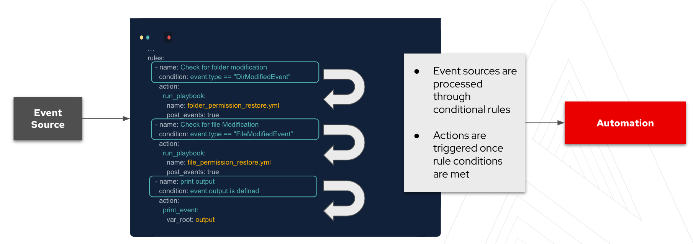
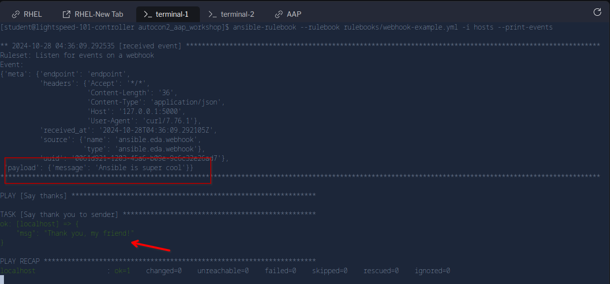

☑️  Rulebook basics
===

`ansible-rulebook` relies on a few components. These components all come together to allow you to respond to events and decide on the next course of action. The three main components to the rulebooks are as follows:

 - **Source** - The sources of our events come from source plugins. These plugins define where we are listening for events.
 - **Condition** - The conditional statements in the rulebook allow us to match criteria on which we want to have some kind of response to.
 - **Action** - Lastly, the action is our response once the condition has been met from the event source. This can be to trigger remediation, log a ticket for observation or generate other events which we would want to respond to.

Currently we have a number of source plugins however this list is being developed and as more partners get involved in the project the list will expand.




|Source Plugin|  Description |
|--|--|
|  Azure Service Bus |  An ansible-rulebook event source module for receiving events from an Azure service bus|
|File|An ansible-rulebook event source plugin for loading facts from YAML files initially and when the file changes|
|Kafka|An ansible-rulebook event source plugin for receiving events via a kafka topic|
|Range|An ansible-rulebook event source plugin for generating events with an increasing index i|
|URL Check|An ansible-rulebook event source plugin that polls a set of URLs and sends events with their status|
|Webhook|An ansible-rulebook event source module for receiving events via a webhook|
|Watchdog|An ansible-rulebook event source plugin for watching file system changes|
|Alertmanager|An event source module for receiving events via a webhook from Alertmanager|

☑️ Task 1 - Writing your first Ansible Rulebook
===

1. Switch to [button label="VS Code"](tab-0) tab.

2. In the **Explorer** tab, right click on the `rulebooks` directory and click on `New File`. Name the file `webhook-example.yml` and press **Enter**.

3. Populate the `webhook-example.yml` file with the following content and save it.

```yaml
# code: language=yaml
---
- name: Listen for events on a webhook
  hosts: all
  ## Define our source for events
  sources:
    - ansible.eda.webhook:
        host: 0.0.0.0
        port: 5000
  ## Define the conditions we are looking for
  rules:
    - name: Say Hello
      condition: event.payload.message == "Ansible is super cool"
  ## Define the action we should take should the condition be met
      action:
        run_playbook:
          name: playbooks/say-what.yml
```

☑️ Task 2 - Understanding the rulebook
===

### Webhook Source

This indicates which source plugin we are using, which in this case is the `webhook` plugin. This plugin lives in the `ansible.eda` collection. For this lab, the `ansible.eda` collection is pre-installed.

  ```yaml
  sources:
    - ansible.eda.webhook:
      host: 0.0.0.0
      port: 5000
  ```

The rule we are using which provides a conditional is specified, and in this example is looking for a message:

  ```yaml
  rules:
    - name: Say Hello
      condition: event.payload.message == "Ansible is super cool"
  ```

Lastly, in our rulebook we have an action, so when the rule condition is met, the corresponding `action` will be triggered.

  ```yaml
  action:
    run_playbook:
      name: playbooks/say-what.yml
  ```

We have not written this playbook yet, so let's do that!

☑️ Task 3 - Creating the say-what.yml playbook
===

1. In the **Explorer** tab, right click on the `playbooks` directory and click on `New File`. Name the file `say-what.yml` and press **Enter**.

2. Populate the `say-what.yml` playbook with the following content and save it.

```yaml
---
- name: Say thanks
  hosts: localhost
  gather_facts: false
  tasks:
    - name: Say thank you to sender
      ansible.builtin.debug:
        msg: "Thank you, {{ ansible_eda.event.body.sender | default('my friend') }}!"
```

3. Finally, **verify** (do not edit, only make sure it is there) the `localhost` entry exists in your `hosts` file.
4. The content of the `/home/student/aap_workshop/hosts` file should be the following:

  ```ini
  localhost

  [routers]
  cisco
	cisco2
	cisco3

  [routers:vars]
  ansible_connection=ansible.netcommon.network_cli
  ansible_network_os=cisco.ios.ios
  ansible_user=admin
  ```

☑️ Task 4 - Running our first Ansible Rulebook
===

1. Change to the [button label="Terminal"](tab-3) tab

> [!NOTE]
> Ensure that you are in the `/home/rhel/aap_workshop` directory.

2. Execute the rulebook with the following command:

  ```bash
  ansible-rulebook --rulebook rulebooks/webhook-example.yml -i hosts --print-events
  ```

> [!NOTE]
>   The `--print-events` flag is optional, but it helps us observe all the events that the running `ansible-rulebook` process receives.

☑️ Task 5 - Trigger Events
===

1. Let's go ahead and try to trigger some messages and responses
2. Now go to the [button label="curl"](tab-4) tab,
3. We will use the `curl` command to post a message to the endpoint created by `ansible-rulebook`:

  ```bash
  curl -H 'Content-Type: application/json' -d "{\"message\": \"Ansible is alright\"}" 127.0.0.1:5000/endpoint
  ```

3. From the [button label="Terminal"](tab-3) tab, check that the message was received. You will notice it didn't match the rule we set, so nothing was done.

  ```bash
    $ ansible-rulebook --rulebook rulebooks/webhook-example.yml -i hosts --print-events

    ** 2024-10-28 04:29:03.998635 [received event] ****************************************
    Ruleset: Listen for events on a webhook
    Event:
    {'meta': {'endpoint': 'endpoint',
              'headers': {'Accept': '*/*',
                          'Content-Length': '33',
                          'Content-Type': 'application/json',
                          'Host': '127.0.0.1:5000',
                          'User-Agent': 'curl/7.76.1'},
              'received_at': '2024-10-28T04:29:03.998153Z',
              'source': {'name': 'ansible.eda.webhook',
                        'type': 'ansible.eda.webhook'},
              'uuid': 'd3a450bd-f2f4-4174-829f-352029842468'},
    'payload': {'message': 'Ansible is alright'}}
    ***************************************************************************************
  ```

4. Switch back to the [button label="curl"](tab-4) tab, and now use `curl` to post a message that actually matches the condition we set:

  ```bash
  curl -H 'Content-Type: application/json' -d "{\"message\": \"Ansible is super cool\"}" 127.0.0.1:5000/endpoint
  ```

5. As soon as the `ansible-rulebook` process receives the above event via the `webhook` source plugin, since this time, the rule condition `event.payload.message == "Ansible is super cool"` is met it starts executing the
  `say-what.yml` playbook .

6.In the [button label="Terminal"](tab-3) tab, check that the message was received and the playbook triggered.


  

✅ Next Challenge
===

Press the `Next` button below to go to the next challenge once you’ve completed the task.
