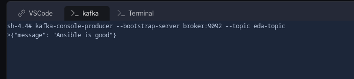

☑️ Task 1 - Writing your second Ansible Rulebook
===

1. Switch to the[button label="VS Code"](tab-0)  tab.
2. In the **Explorer** tab, right click on the `rulebooks` directory and click on `New File`.
3. Name the file `kafka-example.yml` and press **Enter**.
4. Populate the `kafka-example.yml` file with the following content and save it.

  ```yaml
  # code: language=yaml
  ---
  - name: Read messages from a kafka topic and act on them
    hosts: all
    ## Define our source for events
    sources:
      - ansible.eda.kafka:
          host: broker
          port: 9092
          topic: eda-topic
          group_id:

    ## Define the conditions we are looking for
    rules:
      - name: Say Hello
        condition: event.body.message == "Ansible is cool"
        ## Define the action we should take should the condition be met
        action:
          run_playbook:
            name: playbooks/say-what.yml
  ```

☑️ Task 2 - Understanding the rulebook
===

We can see in this example the components we mentioned above:

### Kafka Topic Source

In this rulebook, we are going to use Kafka messages in a `topic` and respond to a specific message.

- Take note of the source plugin being used - `ansible.eda.kafka`. Similar to the webhook one, this source plugin lives in the `ansible.eda` collection as well.

- The source is pointing to a kafka host called `broker` and topic called `eda-topic` on port `9092`.

- The rule is looking for a message on that topic that matches the text `Ansible is cool`, and when it matches, the `say-what.yml` playbook is going to be run.

☑️ Task 3 - Running the Rulebook
===

1. Go to the [button label="Terminal"](tab-2) tab.
> [!NOTE]
> Ensure that you are in the `/home/rhel/aap_workshop` directory.
2. Execute the rulebook with the following command:

  ```bash
  ansible-rulebook --rulebook rulebooks/kafka-example.yml -i hosts --print-events
  ```

> [!NOTE]
>  The `--print-events` flag is optional, but it helps us observe all the events that the running `ansible-rulebook` process receives.

☑️ Task 4 - Trigger Events from Kafka
===

Now that we have `ansible-rulebook` listening, lets start up our Kafka messages.

1. From the [button label="kafka"](tab-1)tab, use the following command to start the `producer` client which will allow you to send messages to the topic.

> [!NOTE]
> The following command starts an interactive terminal client, copy your messages on the `>` prompt and hit enter to send

  ```bash
  kafka-console-producer --bootstrap-server broker:9092 --topic eda-topic
  ```

2. Send a message using the client started in the previous step. The following message should not trigger a response from `ansible-rulebook`:

  ```bash
  {"message": "Ansible is good"}
  ```

Your input should look like this:



3. From the [button label="Terminal"](tab-2) tab, see that the message has been read from the topic.

  

4. From the [button label="kafka"](tab-1) tab, send a message using the running kafka client that will be a match the condition in the active rulebook:

  ```bash
  {"message": "Ansible is cool"}
  ```

5. From the [button label="Terminal"](tab-2)  tab, see that the message has been read from the topic and the playbook `say-what.yml` has been executed.

6. Event data is **automatically** passed to the Ansible playbook.
7. Try sending another message specifying the `sender` parameter with your name from the [button label="kafka"](tab-1) tab.

> [!NOTE]
> Make sure to replace YOUR NAME with your actual name below!

  ```bash
  {"message": "Ansible is cool", "sender":"YOUR NAME"}
  ```
8. Check the [button label="Terminal"](tab-2)  tab, see that the message has been read from the topic and the playbook `say-what.yml` has been executed with your name.

  

9. You will notice in the `say-what.yml` playbook, we have specified the following: `ansible_eda.event`. This allows us to reference the event data from ansible-rulebook.

Congratulations!
===

That brings us to the end of this exercise. Congratulations on writing your first set of Ansible Rulebooks and setting into the world of event driven automation using Ansible! 🎊

For more information on `ansible-rulebook` CLI, rules, conditions, actions and event sources, check out the [documentation](https://ansible.readthedocs.io/projects/rulebook/en/stable/).


✅ Next Challenge
===
You have successfully completed the `Introduction to Event-Driven Ansible - ansible-rulebook` exercise!

Press the `Next` button below to go to the next challenge once you’ve completed the task.
